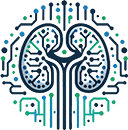

# Kidney Tissue Characterization using Normalized Raman Imaging (NoRI) and Segment-Anything

## Abstract
This study addresses the computational challenges of accurately segmenting and quantifying cellular components in kidney tissue using high-resolution imaging technologies like normalized Raman imaging (NoRI). To overcome the complexity of analyzing large, multi-channel datasets, we developed a computational pipeline integrating classical image processing techniques with machine learning models. The pipeline includes preprocessing, segmentation with the Segment Anything Model (SAM), pixel-based classification via Ilastik, and post-processing refinements. Key structures—tubules, nuclei, brush borders, and lumens—are segmented to quantify protein and lipid concentrations. Our approach achieves high accuracy, with an F1 score of 0.9340 for kidney tubule segmentation, enhanced by a custom contrast-enhancement technique for SAM. Comparative evaluations confirm its superiority over conventional segmentation methods, while biological analyses reveal insights into protein and lipid distribution across different kidney regions, sexes, and experimental conditions. This robust and scalable framework significantly improves segmentation accuracy and efficiency, making it broadly applicable to bioimage analysis in kidney pathology and other tissue types.

:computer: [Computation Paper](#)   |   :microscope: [Bio Paper](#)   |   :file_folder: [Dataset](#)

---
## Installation
Clone the repository and install dependencies:  
```bash
git clone https://github.com/HMS-IAC/NoRI.git
cd NoRI
pip install -r requirements.txt
```

## Usage
To use this repo on your images, you can use the following files for specific tasks:
1. [segment_tubules.py](nori/segment_tubules.py): To process raw NoRI images and segment tubules.
2. [substructure_ilastik.py](nori/substructure_ilastik.py): To create individual substructure segmentation from the Ilastik output.
3. [glue.py](nori/glue.py): To combine all segmentations, measure features and intensities and export csv.

*Note: The data directory is hard-coded inside each python script, so please check them and add correct path before running the scripts.* 

## Collaborators
This project was a collaboration between the [Kirschner lab](https://www.kirschnerlab.org/) and [Image Analysis Collaboratory](https://iac.hms.harvard.edu/).


## Citation
```bash
@article{NoRI2025,
  author = {Authors},
  title = {Title of the Paper},
  journal = {Journal Name},
  year = {2025},
  volume = {XX},
  pages = {XX-XX},
  doi = {Insert DOI}
}
```

## Contact
For questions and collaboration opportunities, contact:
* :round_pushpin: Image Analysis Collaboratory at Harvard Medical School
* :email: Email: [iac@hms.harvard.edu](mailto:iac@hms.harvard.edu)
* :globe_with_meridians: Website: [HMS-IAC](https://iac.hms.harvard.edu/)
